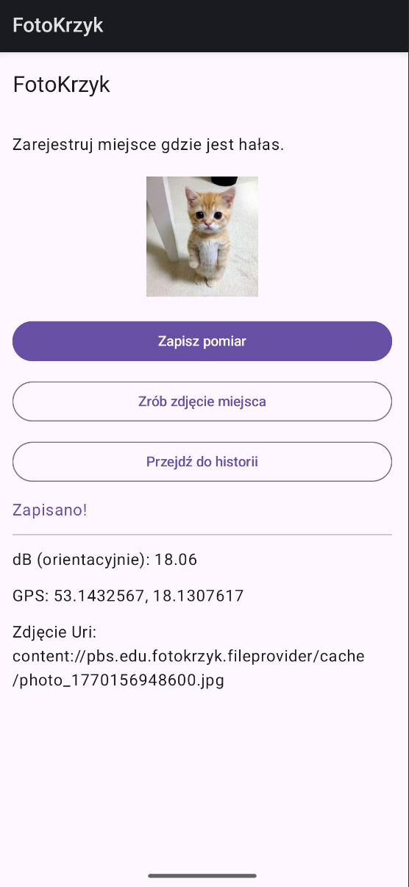
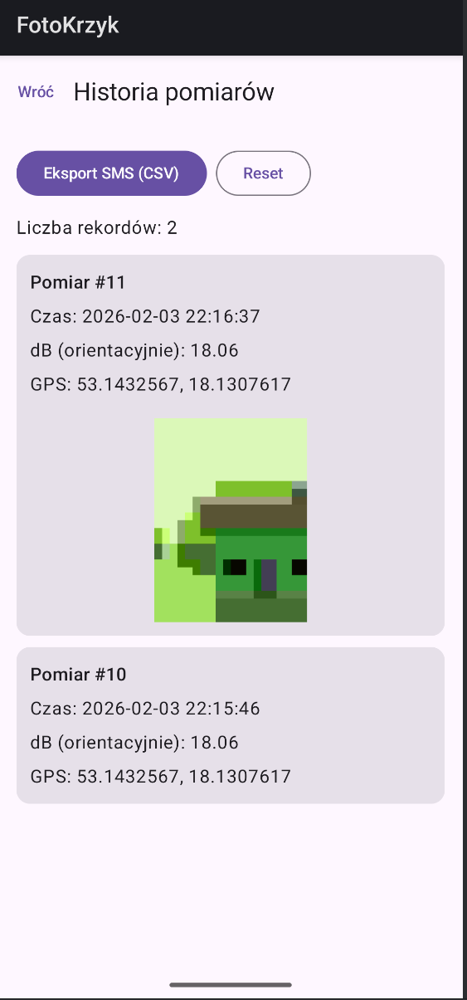

# FotoHałas

**Autor:** Szymon Piórkowski \
**Przedmiot:** Programowanie Aplikacji Mobilnych [LAB]


---

## 1. Wstęp

**FotoHałas** to aplikacja mobilna służąca do rejestrowania miejsc o podwyższonym poziomie hałasu. Użytkownik może dokonać pomiaru natężenia dźwięku (w decybelach), pobrać aktualną lokalizację GPS oraz wykonać zdjęcie dokumentujące źródło hałasu. Wszystkie pomiary są zapisywane w lokalnej bazie danych i mogą być przeglądane w historii lub wyeksportowane do wiadomości SMS w formacie CSV.

### Główne funkcjonalności:
* 🎙️ **Pomiar hałasu:** Szacunkowy pomiar natężenia dźwięku (dB) przy użyciu mikrofonu.
* 📍 **Geolokalizacja:** Automatyczne pobieranie współrzędnych (szerokość i długość geograficzna).
* 📸 **Dokumentacja wizualna:** Możliwość zrobienia zdjęcia miejsca zdarzenia.
* 🗄️ **Historia pomiarów:** Przeglądanie zapisanych zgłoszeń z podziałem na karty.
* 📤 **Eksport danych:** Udostępnianie historii pomiarów przez SMS (format CSV).



---

## 2. Stos Technologiczny (Tech Stack)

Aplikacja została napisana w języku **Kotlin** z wykorzystaniem nowoczesnych bibliotek Android Jetpack.

* **UI:** Jetpack Compose (Material Design 3) – deklaratywny interfejs użytkownika.
* **Architektura:** MVVM (Model-View-ViewModel).
* **Baza danych:** Room Database (SQLite wrapper).
* **Asynchroniczność:** Kotlin Coroutines & Flow.
* **Nawigacja:** Jetpack Navigation Compose.
* **Lokalizacja:** Google Play Services Location (FusedLocationProvider).
* **Obraz:** Coil (ładowanie obrazów), Camera (poprzez `ActivityResultContracts`).
* **Dostęp do sprzętu:** MediaRecorder (audio), LocationServices (GPS).

---

## 3. Architektura Aplikacji

Projekt realizuje wzorzec **MVVM**, co zapewnia separację logiki biznesowej od warstwy prezentacji.

### 3.1. Warstwa Danych (Model)
Odpowiada za trwałe przechowywanie danych oraz logikę dostępu do nich.
* **`Measurement.kt`**: Encja bazy danych (Entity). Reprezentuje pojedynczy pomiar (id, czas, GPS, dB, ścieżka do zdjęcia).
* **`MeasurementDao.kt`**: Interfejs dostępu do danych (Data Access Object). Zawiera metody `insert`, `delete` oraz `observeAll` (zwracającą `Flow<List>`).
* **`AppDatabase.kt`**: Główna klasa bazy danych Room. Implementuje wzorzec Singleton.
* **`Repository.kt`**: Pośrednik między ViewModel a DAO. Abstrakcja źródła danych.

### 3.2. Warstwa Logiki (ViewModel)
Zarządza stanem ekranów i komunikuje się z Repozytorium oraz sensorami.
* **`HomeViewModel.kt`**:
    * Obsługuje logikę mikrofonu (`MediaRecorder`) do obliczania amplitudy.
    * Obsługuje pobieranie lokalizacji (`FusedLocationProviderClient`).
    * Przelicza amplitudę na przybliżone decybele wg wzoru: `20 * log10(maxAmplitude)`.
    * Zarządza stanem ekranu głównego (`HomeState`).
* **`HistoryViewModel.kt`**:
    * Pobiera listę pomiarów z bazy w formie strumienia (`Flow`).
    * Generuje plik CSV z historią i przygotowuje Intent do wysyłki SMS.
    * Obsługuje czyszczenie bazy danych.

### 3.3. Warstwa Prezentacji (View)
Ekrany zbudowane w Jetpack Compose.
* **`MainActivity.kt`**: Punkt wejścia aplikacji, ustawia motyw i nawigację.
* **`AppNav.kt` / `Routes.kt`**: Konfiguracja grafu nawigacji (Ekrany: Home, History).
* **`HomeScreen.kt`**: Ekran główny z przyciskami do pomiaru, zdjęcia i nawigacji. Wyświetla status pomiaru.
* **`HistoryScreen.kt`**: Ekran listy z użyciem `LazyColumn`.
* **`MeasurementCard.kt`**: Komponent UI wyświetlający pojedynczy wpis (zdjęcie, dane, data).

---

## 4. Kluczowe Rozwiązania Implementacyjne

### 4.1. Pomiar Hałasu
Aplikacja wykorzystuje klasę `MediaRecorder` do próbkowania dźwięku. Nie nagrywa ona dźwięku w sposób ciągły do pliku w celu odsłuchu, lecz analizuje maksymalną amplitudę (`maxAmplitude`).

```kotlin
// Fragment logiki z HomeViewModel.kt
val approxDbRaw = 20 * log10(safeAmp.toDouble())
val approxDb = round(approxDbRaw * 100) / 100
```

### 4.2. Obsługa Uprawnień
Aplikacja dynamicznie prosi użytkownika o wymagane uprawnienia przy użyciu ActivityResultContracts.RequestMultiplePermissions:

RECORD_AUDIO – do pomiaru hałasu.

ACCESS_FINE_LOCATION – do precyzyjnej lokalizacji.

CAMERA – (obsługiwane przez osobny Intent aparatu).

### 4.3. Zapis Zdjęć
Zdjęcia nie są zapisywane jako Blob w bazie danych (co spowolniłoby aplikację), lecz jako pliki w pamięci podręcznej (cacheDir), a w bazie przechowywany jest tylko ciąg znaków Uri (String). Do wyświetlania zdjęć użyto biblioteki Coil.

### 4.4. Eksport Danych (CSV via SMS)
Funkcja shareCsvBySms w HistoryViewModel iteruje po liście pomiarów, buduje łańcuch znaków w formacie CSV i uruchamia systemowy Intent.ACTION_SENDTO.
```kotlin
// Przykład generowanego formatu
id,timestamp,lat,lng,approxDb,photoUri
1,1706543210000,52.2297,21.0122,65.5,content://...
```
## 5. Wymagania i Uruchomienie
Wymagania systemowe:
System Android: Min SDK 24 (Android 7.0) lub nowszy.

Hardware: Urządzenie z mikrofonem i modułem GPS.

Instrukcja obsługi:
Ekran Główny:

Kliknij "Zrób zdjęcie miejsca" (opcjonalnie), aby udokumentować lokalizację.

Kliknij "Zapisz pomiar". Aplikacja poprosi o uprawnienia (jeśli to pierwszy raz), następnie zmierzy hałas (ok. 2 sekundy) i pobierze lokalizację.

Komunikat "Zapisano!" potwierdza operację.

Ekran Historii:

Kliknij "Przejdź do historii", aby zobaczyć listę pomiarów.

Użyj przycisku "Eksport SMS", aby wysłać raport.

Użyj przycisku "Reset", aby wyczyścić bazę danych.

6. Podsumowanie
Aplikacja FotoHałas spełnia założenia projektu zaliczeniowego, integrując kluczowe komponenty systemu Android: bazę danych, sensory sprzętowe (mikrofon, GPS, kamera) oraz nowoczesny interfejs użytkownika. Kod jest modularny, łatwy w testowaniu i zgodny z obecnymi standardami Google (Modern Android Development).